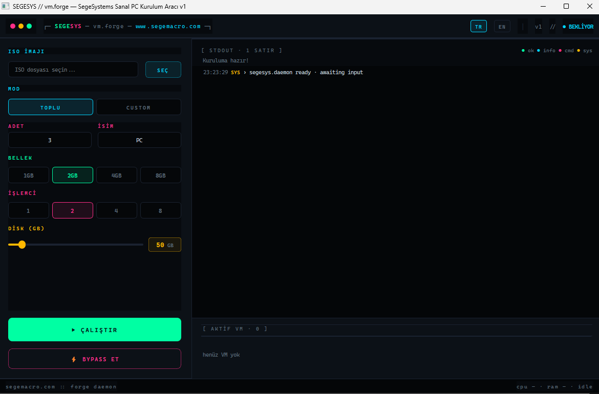

# SegeSystems Sanal PC Kurulum Aracı v1.2

> Çok dilli (TR/EN), toplu Windows VM kurulum aracı.
> VMware Workstation üzerinde tek tıkla onlarca sanal makineyi otomatik kurar.
> [www.segemacro.com](https://www.segemacro.com)




---

## Ne Yapar?

VMware Workstation ile **tek tek 5 dakika klikleme** yerine programa "3 adet PC kur, her birine 50 GB disk + 2 GB RAM ver, ISO'yu da bağla" dersin; geri kalan her şeyi otomatik yapar:

1. `~/Documents/Virtual Machines/PC-1, PC-2, PC-3` klasörleri açar
2. Her VM için `.vmx` config + `.vmdk` disk + `.flp` autounattend floppy üretir
3. VMware'i fırlatır, VM'lere güç verir
4. Windows Setup ISO'dan boot eder, **floppy'deki `Autounattend.xml`'i** otomatik bulup soru sormadan kurulumu tamamlar
5. Bittiğinde **BYPASS ET** butonuyla VMware tespitini gizleyen anahtarları enjekte eder

---

## Özellikler

- 🌍 **TR/EN dil seçeneği** — sağ üstte tek tıkla geçiş, son seçim hatırlanır
- 📦 **İki kurulum modu:**
  - **TOPLU** — adet + isim verirsin, hepsi aynı RAM/CPU/disk ile (`PC-1, PC-2, PC-3`)
  - **CUSTOM** — her VM kendine ayrı ad/RAM/CPU/disk
- 🔧 **CPU seçimi** — 1/2/4/8 vCPU per VM
- 💾 **RAM** — 1/2/4/8 GB
- 💿 **Disk slider** — 10–500 GB
- 📂 **Özel base dizini** *(v1.2)* — VM'leri D:, E:, başka sürücüye yönlendir; ayar `settings.json`'da kalıcı
- ⚙️ **Düzenlenebilir bypass anahtarları** *(v1.2)* — UI'dan ⚙ butonu, kaynak koda dokunmadan değiştir; `bypass.txt`'e kaydedilir
- 📜 **Canlı timestamped log** — `vmrun`, `vmware-vdiskmanager` çıktısı satır satır görünür
- 🎯 **Aktif VM rafı** — oluşturulan her VM bir kart olarak alta düşer
- ⚡ **VMware bypass** — kurulum sonrası anti-detection anahtarlarını otomatik enjekte
- 🛡️ **SCSI disk spoof çalışıyor** *(v1.1)* — Aygıt Yöneticisi'nde "Samsung 970 EVO Plus" görünür
- 🤖 **Otomatik Windows kurulumu** — `iso.xml` + per-VM floppy ile soru sormadan kurar

---

## Sistem Gereksinimleri

| Bileşen | Gereksinim |
|---|---|
| OS | Windows 10/11 (Workstation Windows için) |
| Python | 3.8 veya üstü |
| PyQt5 | `pip install PyQt5` |
| VMware Workstation | **15.5.7 önerilir** (diğer sürümlerde test edilmedi) |
| Disk | Her VM için ayrılan kadar boş alan |
| RAM | Host'ta yeterli boş RAM (VM başına ayrılan + 4 GB host) |

---

## Kurulum

```bash
git clone https://github.com/<kullanıcı>/segesystems-vmforge.git
cd segesystems-vmforge
pip install -r requirements.txt
python SegeSystems_SanalPC_Kurulum_v1.py
```

VMware Workstation'ın varsayılan yola kurulu olması gerekiyor:
```
C:\Program Files (x86)\VMware\VMware Workstation\
```

Farklı yere kurduysan `SegeSystems_SanalPC_Kurulum_v1.py` içindeki şu sabitleri güncelle:
```python
VMRUN_PATH = r'C:\...\vmrun.exe'
VMWARE_PATH = r'C:\...\vmware.exe'
VDISK_PATH = r'C:\...\vmware-vdiskmanager.exe'
```

---

## Kullanım

### 1) Kurulum Akışı (TOPLU mod)

1. Programı çalıştır.
2. **ISO** alanına Windows ISO'sunu seç.
3. **TOPLU** sekmesi aktif (varsayılan).
4. **ADET** = 3, **İSİM** = `PC` → `PC-1`, `PC-2`, `PC-3` üretilecek.
5. **BELLEK**, **İŞLEMCİ**, **DİSK** seçimlerini yap.
6. **ÇALIŞTIR** → onayla.
7. VMware pencereleri açılır, içlerinde Windows kuruluyor — programdaki log'u izleyebilirsin.
8. Kurulumlar bittiğinde her VM'e VMware Tools'u kur (Üst menü → VM → Install VMware Tools).
9. **⚡ BYPASS ET** → VM'leri kapatır, anti-detection anahtarlarını yazar, ISO'yu söker, boot sırasını HDD'ye çevirir.

### 2) Custom Mod

Her VM için ayrı yapılandırma:
1. Sol panelde **CUSTOM** sekmesi.
2. **+ VM EKLE** ile satır ekle.
3. Her satırda: ad, RAM (combo), CPU (combo), Disk (sayısal).
4. `×` ile satır sil.
5. **ÇALIŞTIR** → her VM kendi ayarlarıyla oluşturulur.

### 3) Bypass

VMware Tools kurulu olduktan **sonra** kullan. Aksi takdirde Windows içindeki sanal grafik bozulur. Buton:
- VM'leri sırayla `vmrun stop` ile kapatır
- `.vmx` dosyalarına 22 anti-detection satırı ekler
- ISO'yu söker (`ide1:0.startConnected = FALSE`)
- Boot sırasını HDD-öncelikli yapar

---

## Otomatik Kurulum (`iso.xml`)

Programın yanında `iso.xml` varsa, her VM için bu şablonu kullanarak Windows'a *"hiçbir şey sorma kendin kur"* der.

`iso.xml` ne içeriyor (mevcut varsayılan):
- Dil: Türkçe
- Klavye: TR Q
- Saat dilimi: Turkey Standard Time
- Disk: tamamen sil + 100 MB System Reserved + uzayan C: bölümü (MBR/BIOS)
- Lisans: otomatik kabul
- Kullanıcı: `User`, **şifre boş**, Administrator grubu, otomatik giriş (1 kez)
- ComputerName: program her VM için kendi adıyla override eder

`iso.xml`'i silersen / yeniden adlandırırsan, program `manuel kurulum` moduna düşer ve tüm Windows soruları sana sorulur.

### Özelleştirme

`iso.xml` standart Microsoft autounattend formatıdır. Düzenlemek için:
- **Şifre eklemek:** `<Password><Value>SIFRE</Value></Password>`
- **Dil değiştirmek:** `tr-TR` → `en-US` (ve `041f:0000041f` → `0409:00000409`)
- **Edisyon seçmek:** `<IMAGE/INDEX><Value>1</Value></...>` → istediğin index. Listelemek için:
  ```cmd
  dism /Get-WimInfo /WimFile:E:\sources\install.wim
  ```
- **Hesap adı:** `<Name>User</Name>` üç yerde geçer (LocalAccount × 2 + AutoLogon)

Detaylı şema: [Microsoft autounattend referansı](https://learn.microsoft.com/en-us/windows-hardware/customize/desktop/unattend/)

---

## Uyumlu ISO'lar

[docs/iso-uyumluluk.md](docs/iso-uyumluluk.md) — tam liste.

### Hızlı özet

✅ **Çalışır** (mevcut `iso.xml` ile sorunsuz):
- Windows 7 SP1 x64 Türkçe
- Windows 8.1 x64 Türkçe
- Windows 10 x64 (1903 – 22H2) Türkçe
- Windows Server 2012/2016/2019/2022 x64 Türkçe

⚠️ **Çalışır ama `iso.xml` özelleştirmesi gerekir:**
- Windows 11 21H2/22H2/23H2 → TPM/SecureBoot bypass eklemen lazım
- Windows 11 24H2 → UEFI/GPT disk düzeni gerekiyor (XML MBR yazıyor)
- İngilizce ISO'lar → `tr-TR` → `en-US` değişikliği
- Çok edisyonlu ISO'lar → `IMAGE/INDEX` ayarı

❌ **Çalışmaz:**
- 32-bit (x86) Windows — XML `amd64`'e sabit
- ARM64 Windows
- Linux / macOS / Hackintosh ISO'ları
- WinPE / kurtarma diskleri

---

## VMware Bypass Hakkında

[docs/bypass.md](docs/bypass.md) — detaylı liste.

### Hızlı özet

**Geçer:**
- ✅ CPUID hypervisor flag (`IsHypervisorPresent`)
- ✅ WMI `Win32_BIOS`/`Win32_ComputerSystem` manufacturer kontrolü
- ✅ VMware backdoor I/O port (`0x5658`)
- ✅ VMware Tools API queries
- ✅ Pafish, VMDE gibi araçların çoğu testi

**Geçmez:**
- ❌ Kernel-level anti-cheat: Vanguard, modern EAC, BattlEye
- ❌ MAC OUI kontrolü (`00:50:56` — VMware) — opsiyonel olarak `.vmx`'e `ethernet0.address` ekleyerek manuel düzeltebilirsin
- ❌ Yazılım hardware fingerprinting (TPM, GPU PCI ID)

⚠️ **Yasal:** Bu araç araştırma/geliştirme/test amaçlıdır. Anti-cheat ihlali, sahte hesap, malware analizi gibi kullanımlar size aittir.

---

## Sorun Giderme

| Sorun | Çözüm |
|---|---|
| `VMware bulunamadı` | VMware Workstation'ı `C:\Program Files (x86)\VMware\` altına kur, ya da kod içindeki sabitleri güncelle |
| VM açılınca "Press any key" sıkıştı | Bypass'tan önce VMware Tools'u kurmayı unutmuşsun — Tools'u kur, sonra bypass |
| Floppy bağlanmıyor → Setup soru soruyor | `iso.xml` programın yanında değil, ya da .flp üretemedi (log'a bak) |
| Kurulum durdu, mavi ekran | TPM/UEFI kontrolü Win11'de — `iso.xml`'e bypass anahtarı ekle |
| `vmrun start` exit code 1 | Önceki VMware penceresi açıkken yenisini başlatmaya çalışıyor — VMware'i kapat ve tekrar dene |
| Disk yetersiz | VM klasörünün olduğu diskte boş alan kontrol et |
| Türkçe karakterler bozuk | Programı `python -X utf8 SegeSystems_SanalPC_Kurulum_v1.py` ile çalıştır |

---

## Proje Yapısı

```
.
├── SegeSystems_SanalPC_Kurulum_v1.py   # Ana program (PyQt5)
├── iso.xml                                # Windows autounattend şablonu
├── arayuz.png                             # Arayüz ekran görüntüsü
├── requirements.txt
├── README.md
├── KULLANIM.md
├── LICENSE
├── settings.json                          # (otomatik) base_dir + dil tercihi
├── bypass.txt                             # (opsiyonel) düzenlenmiş bypass anahtarları
└── docs/
    ├── iso-uyumluluk.md                   # Detaylı ISO listesi
    └── bypass.md                          # Bypass anahtarları açıklaması
```

`settings.json` ve `bypass.txt` ilk kullanımda otomatik oluşturulur, repo'ya dahil değildir (.gitignore).

---

## Changelog

### v1.2 — 2026-05
- ➕ **Özel base dizini** — VM klasörlerini istediğin sürücüye yönlendir (D:, E:, NAS yolu, vb.). UI'da ISO seçicinin altına eklendi, `settings.json` ile kalıcı.
- ➕ **Düzenlenebilir bypass anahtarları** — `BYPASS ET` butonunun yanına ⚙ ikonu eklendi. Kullanıcı kaynak koda dokunmadan UI'dan anahtarları düzenleyebilir; düzenlemeler `bypass.txt`'e kaydedilir, "Varsayılana Dön" butonu ile geri yüklenir.
- ➕ **Dil tercihi kalıcı** — TR/EN seçimi `settings.json`'da hatırlanır.

### v1.1 — 2026-05
- 🐛 **SCSI controller fix** — Diskler artık IDE yerine LSI Logic Parallel SCSI ile oluşturuluyor. Bu sayede `BYPASS_KEYS`'teki `scsi0:0.productID` / `vendorID` anahtarları artık etkili — Aygıt Yöneticisi'nde gerçekten "Samsung 970 EVO Plus" olarak görünür.
- 📝 `vmware-vdiskmanager` çağrısı `-a ide` → `-a lsilogic` olarak güncellendi.
- 📝 `BYPASS_KEYS` disk modeli `"SSD"` → `"970 EVO Plus"` (daha gerçekçi).

### v1.0 — 2026-05
- ✨ İlk yayın
- ✨ Cyberpunk arayüz, TR/EN dil, toplu/custom mod
- ✨ 1-8 vCPU, 1-8 GB RAM, 10-500 GB disk seçimi
- ✨ Otomatik Windows kurulumu (autounattend.xml + FAT12 floppy üreticisi)
- ✨ VMware bypass — 22 anti-detection anahtarı
- ✨ Canlı log, aktif VM rafı, durum göstergesi

---

## Lisans

[MIT](LICENSE)

---

## Katkı

PR'lar açık. Özellikle:
- Win11 UEFI/GPT için ayrı `iso-win11.xml` profili
- Linux dağıtımları için preseed/kickstart desteği
- VirtualBox / Hyper-V desteği

---

**SegeSystems** © 2026 · [www.segemacro.com](https://www.segemacro.com)
